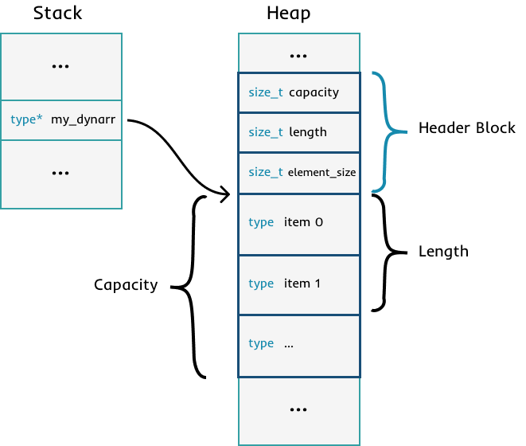

# mclib - Dynamic Array

This is a generic implementation of a growable array/vector. If the storage of the array reaches its end, the
whole array gets resized and further elements can be added. This is an equivalent to `std:vector` in C++ or
`System.Collections.Generic.List` in C#.

## Overview

The Dynamic Array is just a simple array located somewhere on the Heap, which stores a header in front of 
its elements. The Header contains meta information like the length of the array or the size of the included
item blocks (due to it works with `void*` pointers to get generic like behaviours in C).


## Usage

### Import

This is a Single-Header-File Library. So you have to define the Header's Implementation in one of your
project's `.c` files (the best option is a file which does not change very often). This can be achieved
by defining following macro:

```c
#define MCLIB_DYNARRAY_IMPLEMENTATION
#include "mclib/dynarray.h"
```

In every other file you can import the header by just using the include:
```c
#include "mclib/dynarray.h"
```

### Creation

The datatype of the Dynamic Array is the same as a normal array (e.g. `int*`, `char*` or `person_t*`).
But you can also use the dyn_array_t() macro to make clear that this is a dynamic array.

The Dynamic Array Library makes use of the Params Library (for variadic parameters). Check it out to get
more clear about that. Through importing `dynarray.h` you have automatically access to `params.h`!

```c
// Create new dynamic Array
dyn_array_t(int) ints = dyn_array_init(params(int, 10, 20, 30));
// or
int* ints = dyn_array_init(params(int, 10, 20, 30));

// Create empty array
dyn_array_t(int) ints = dyn_array_init(params(int));
```

### Finalize

Because the elements are managed on the heap behind the scenes, the Dynamic Array has to be freed after using it!

```c
// Free the memory of the array after using it
dyn_array_delete(&ints);
```

### Add

There are several options for adding one or more elements. The Array automatically resizes itself if there is
not enough space for the elements.

```c
int a = 10;
dyn_array_add(&ints, &a);   // adding one element has to be done with a pointer due to void*

dyn_array_add_many(&ints, params(int, 40, 50, 60, 70, 80, 90)); // params automatically creates an array out of the given elements

// insert after the given index (must be less than the length of the array)
int value = 45;
dyn_array_insert_one_at(&ints, 4, &value);
dyn_array_insert_many_at(&ints, 4, params(int, 42, 44, 46, 48));
```

### Read

The Dynamic Array acts like a normal array in C. So you can access the items by using the `[]` operator

```c
// Read element of a specific index
int item = ints[3];

// iterating over the array
for (int i = 0; i < dyn_array_length(ints); i++) {
    printf("%d ", ints[i]);
}

printf("\n");
```

### Remove

When one element gets removd, all elements behind that one gets shifted one forward.

```c
// Delete 3 elements beginning at index 4
dyn_array_delete_many(&ints, 4, 3);

// Delete the element at index 2
dyn_array_delete_one(&ints, 2);
```

### Get Several Meta Information

```c
// returns the actual count of the items in the array (= length)
size_t length = dyn_array_length(ints);

// get the count of how many elements could be stored before the array has to resize
// length <= capacity
size_t capacity = dyn_array_capacity(ints);

// returns the size needed for storing one element
size_t element_size = dyn_array_element_size(ints)
```

### Misc (Using, Iterator)

There is also a using macro for dynamic arrays (see generall language extensions).
With that, the finalizer gets automatically called (like using statements in C#)

```c
dyn_array_t(int) ints = dyn_array_init(params(int, 10, 20, 30));

using_dyn_array(ints) {
    dyn_array_add_many(&ints, params(int, 40, 50, 60, 70, 80, 90));
    
    for (int i = 0; i < dyn_array_length(ints); i++) {
        printf("%d ", ints[i]);
    }
    
    printf("\n");
}
```

And there is also an iterator for Dynamic Arrays:

```c
dyn_array_iterator_t iterator = dyn_array_iterator_new((void **) &ints);
void* current;

while((current = dyn_array_iterator_next(&iterator))) {
    printf("%d ", *(int*)current);
}

printf("\n");

dyn_array_iterator_reset(&iterator);
```

## Implementation Details



Content will be added soon....

## Resources

* https://github.com/tezc/sc
* https://github.com/happyfish100/libfastcommon
* https://github.com/nothings/stb
* https://accu.org/conf-docs/PDFs_2021/luca_sass_modern_c_and_what_we_can_learn_from_it.pdf
* https://github.com/eignnx/dynarray
* https://github.com/michaelg29/yt-challenges/tree/master/22%20-%20Generic%20Lists